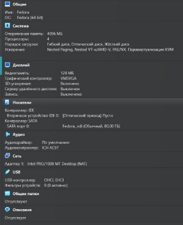
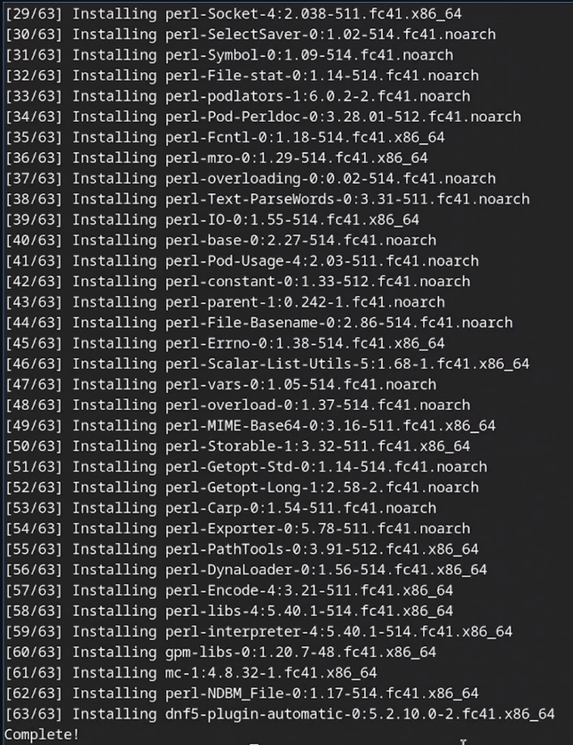
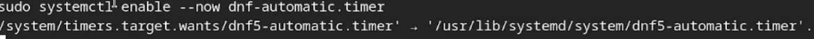
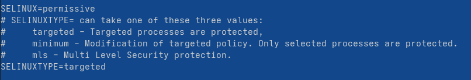
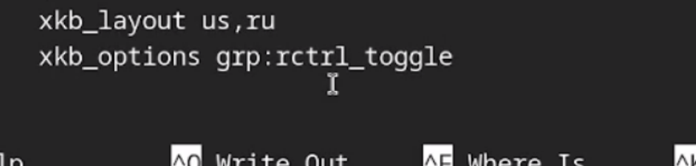
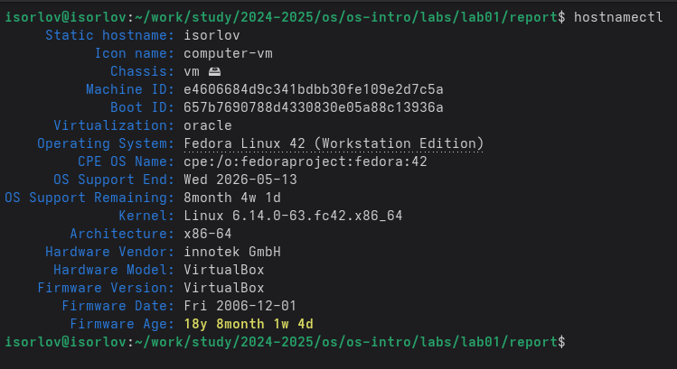
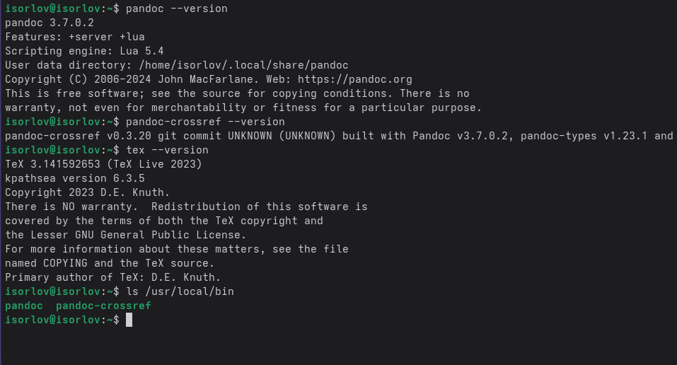
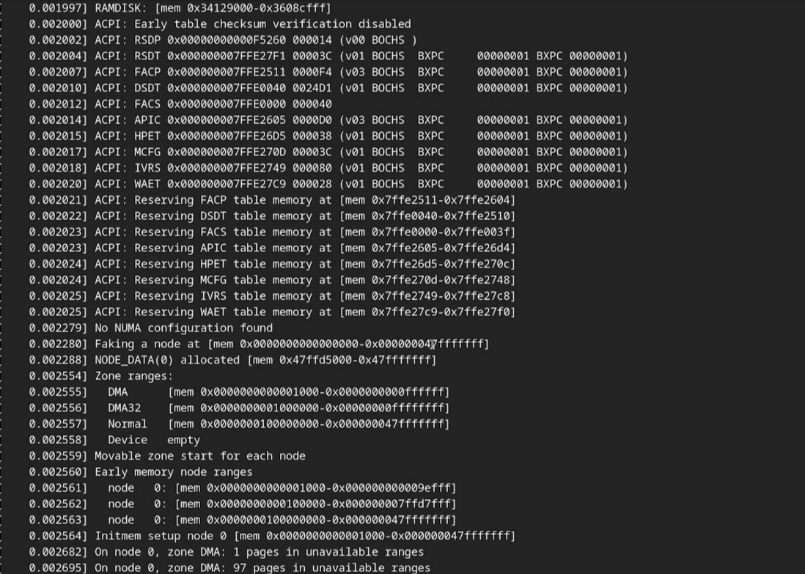

---
## Front matter
lang: ru-RU
title: Лабораторная работа №1
subtitle: Операционные системы
author:
  - Орлов И.С
institute:
  - Российский университет дружбы народов, Москва, Россия
date: 13 августа 2025

## i18n babel
babel-lang: russian
babel-otherlangs: english

## Formatting pdf
toc: false
toc-title: Содержание
slide_level: 2
aspectratio: 169
section-titles: true
theme: metropolis
header-includes:
 - \metroset{progressbar=frametitle,sectionpage=progressbar,numbering=fraction}
---

# Информация

## Докладчик

:::::::::::::: {.columns align=center}
::: {.column width="70%"}

  * Орлов Илья Сергеевич
  * Студент НКАбд-03-24
  * Российский университет дружбы народов
  * [1132241586@pfur.ru](mailto:1132241586@pfur.ru)
:::
::: {.column width="30%"}

:::
::::::::::::::

# Цель работы

Целью данной работы является приобретение практических навыков установки операционной системы на виртуальную машину, настройки минимально необходимых для дальнейшей работы сервисов.

# Задание

- Установка Linux на VirtualBox
- Установка необходимого ПО
- Первоначальная настройка ОС для дальнейшей работы

# Выполнение лабораторной работы

Установил диструбутив на VirtualBox (рис. [-@fig:001]).

{#fig:001 width=70%}

Скачиваю набор необходимых пакетов для работы с ОС. (рис. -@fig:002)

{#fig:002 width=70%}

Запускаю скрипт для автоматического обновления пакетов через пакетный менеджер dnf. (рис. -@fig:003)

{#fig:003 width=70%}

Отключаю защиту SELinux, так как на данном курсе мы не будем рассматривать работу с ней. (рис. -@fig:004)

{#fig:004 width=70%}

Настраиваю xkb, добавляю вторую раскладку клавиатуры с русским языком и задаю переключение на right ctrl. (рис. -@fig:005)

{#fig:005 width=70%}

Проверяю корректность заданного имени для hostname. (рис. -@fig:006)

{#fig:006 width=70%}

Устанавливаю pandoc, pandoc-crossref, texlive для работы над отчетами для лабораторных работ. (рис. -@fig:007)

{#fig:007 width=70%}

# Домашнее задание

Проверяю последовательность загрузки графического окружения командой dmesg | grep -i с указанием вывода желаемого нахождения (рис. -@fig:008)

{#fig:008 width=70%}

# Выводы

В ходе выполнения лабораторный работы приборел навыки установки виртуальной машины на VirtualBox, установил ряд пакетов и настроил ОС для дальнейшей работы на ней.

# Список литературы{.unnumbered}

::: {#refs}
:::

