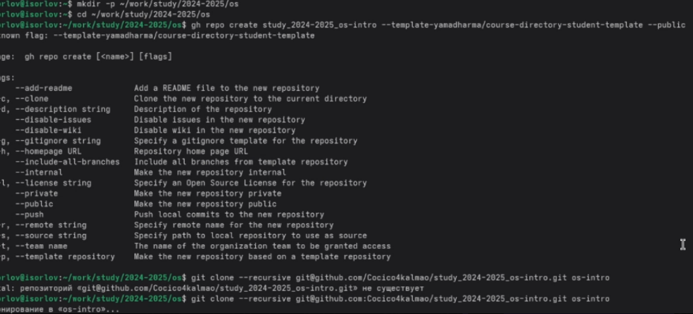
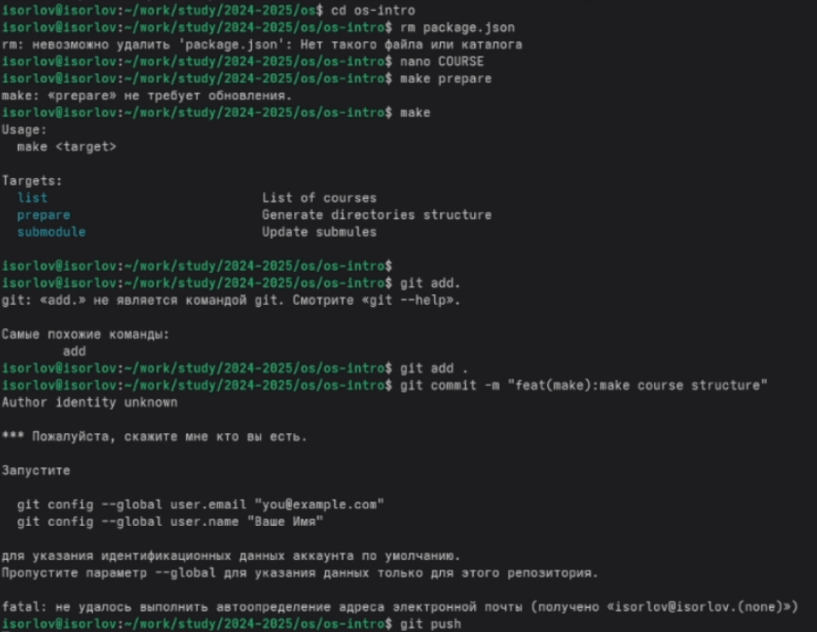

---
## Front matter
title: "Лабораторная работа №2"
subtitle: "Дисциплина: Архитектура компьютера"
author: "Орлов Илья Сергеевич"

## Generic otions
lang: ru-RU
toc-title: "Содержание"

## Bibliography
bibliography: bib/cite.bib
csl: pandoc/csl/gost-r-7-0-5-2008-numeric.csl

## Pdf output format
toc: true # Table of contents
toc-depth: 2
lof: true # List of figures
lot: true # List of tables
fontsize: 12pt
linestretch: 1.5
papersize: a4
documentclass: scrreprt
## I18n polyglossia
polyglossia-lang:
  name: russian
  options:
	- spelling=modern
	- babelshorthands=true
polyglossia-otherlangs:
  name: english
## I18n babel
babel-lang: russian
babel-otherlangs: english
## Fonts
mainfont: IBM Plex Serif
romanfont: IBM Plex Serif
sansfont: IBM Plex Sans
monofont: IBM Plex Mono
mathfont: STIX Two Math
mainfontoptions: Ligatures=Common,Ligatures=TeX,Scale=0.94
romanfontoptions: Ligatures=Common,Ligatures=TeX,Scale=0.94
sansfontoptions: Ligatures=Common,Ligatures=TeX,Scale=MatchLowercase,Scale=0.94
monofontoptions: Scale=MatchLowercase,Scale=0.94,FakeStretch=0.9
mathfontoptions:
## Biblatex
biblatex: true
biblio-style: "gost-numeric"
biblatexoptions:
  - parentracker=true
  - backend=biber
  - hyperref=auto
  - language=auto
  - autolang=other*
  - citestyle=gost-numeric
## Pandoc-crossref LaTeX customization
figureTitle: "Рис."
tableTitle: "Таблица"
listingTitle: "Листинг"
lofTitle: "Список иллюстраций"
lotTitle: "Список таблиц"
lolTitle: "Листинги"
## Misc options
indent: true
header-includes:
  - \usepackage{indentfirst}
  - \usepackage{float} # keep figures where there are in the text
  - \floatplacement{figure}{H} # keep figures where there are in the text
---

# Цель работы

Целью данной работы является изучение идеологии и применения средств контроля версий и освоение умения по работе с git.

# Задание

- базовую конфигурацию для работы с git.
- ключ SSH.
- ключ PGP.
- подписи git.
- на Github.
-  локальный каталог для выполнения заданий по предмету.

# Теоретическое введение

Системы контроля версий (Version Control System, VCS) применяются при работе нескольких человек над одним проектом. Обычно основное дерево проекта хранится в локальном или удалённом репозитории, к которому настроен доступ для участников проекта. При внесении изменений в содержание проекта система контроля версий позволяет их фиксировать, совмещать изменения, произведённые разными участниками проекта, производить откат к любой более ранней версии проекта, если это требуется.

В классических системах контроля версий используется централизованная модель, предполагающая наличие единого репозитория для хранения файлов. Выполнение большинства функций по управлению версиями осуществляется специальным сервером. Участник проекта (пользователь) перед началом работы посредством определённых команд получает нужную ему версию файлов. После внесения изменений, пользователь размещает новую версию в хранилище. При этом предыдущие версии не удаляются из центрального хранилища и к ним можно вернуться в любой момент. Сервер может сохранять не полную версию изменённых файлов, а производить так называемую дельта-компрессию — сохранять только изменения между последовательными версиями, что позволяет уменьшить объём хранимых данных.

# Выполнение лабораторной работы

Произвожу базовую настройку git. (рис. -@fig:001)

{#fig:001 width=70%}

Создаю ssh и gpg ключи. (рис. -@fig:002)

{#fig:002 width=70%}

Экспортирую gpg ключ для авторизации на github. (рис. -@fig:003)

{#fig:003 width=70%}

Настраиваю автоматические подписи для коммитов. (рис. -@fig:004)

{#fig:004 width=70%}

Авторизуюсь на github для работы через терминал. (рис. -@fig:005)

{#fig:005 width=70%}

Создаю директорию курса по шаблону (рис. -@fig:006)

{#fig:006 width=70%}

Настраиваю рабочую директорию (рис. -@fig:007)

{#fig:007 width=70%}

# Контрольные вопросы 

1.VCS - системы для контроля изменений в файлах. Нужны для сохранения истории, совместной работы и отката изменений.

2.Основные понятия:

Хранилище - база версий файлов

Коммит - сохранение изменений

История - все коммиты

Рабочая копия - локальные файлы

3.Виды VCS:

Централизованные (SVN) - одно хранилище

Децентрализованные (Git) - у каждого полная копия

4.Работа в одиночку:

git init

git add

git commit

git log

5.Совместная работа:

git clone

git pull

git push

Решение конфликтов

6.Задачи Git:

Контроль версий

Ветвление

Совместная работа

7.Основные команды:

init, clone, add, commit

push, pull, branch, merge

checkout, status, log

8.Примеры:
Локально: git init → add → commit
Удалённо: clone → push/pull

9.Ветки - для параллельной работы над разными задачами. Пример: git branch feature

10..gitignore - чтобы не коммитить ненужные файлы (логи, бинарники). Пример:
*.log
tmp/

# Выводы

В результате выполнения данной лабораторной работы я приобрел необходимые навыки работы с гит, научился созданию репозиториев, gpg и ssh ключей, настроил каталог курса и авторизовался в gh.

