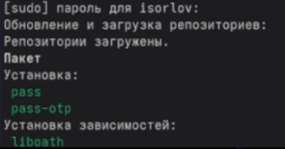
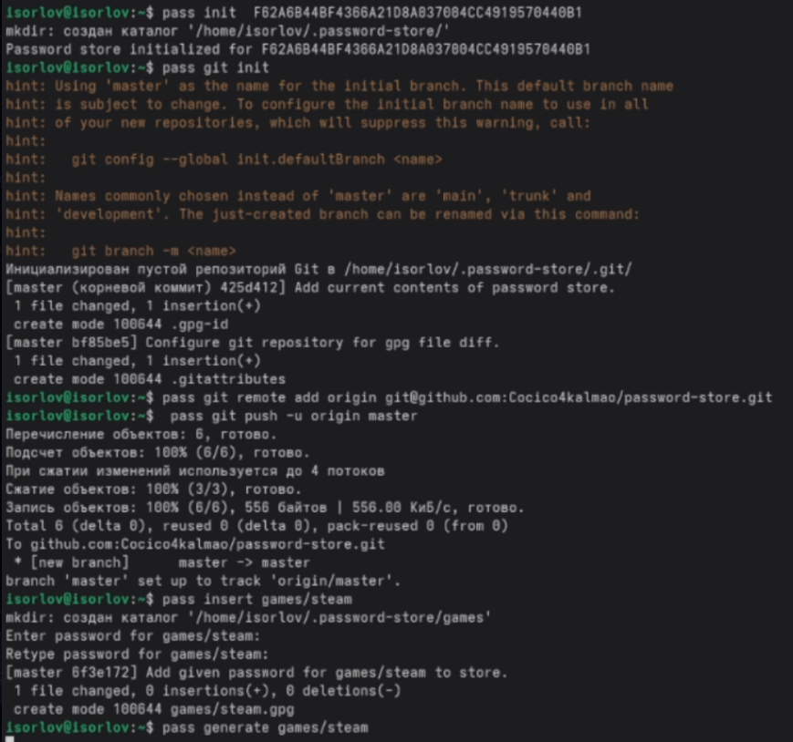
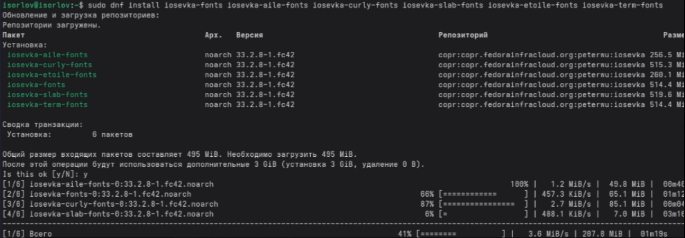
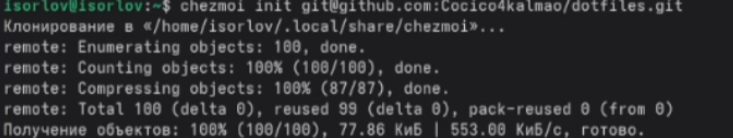
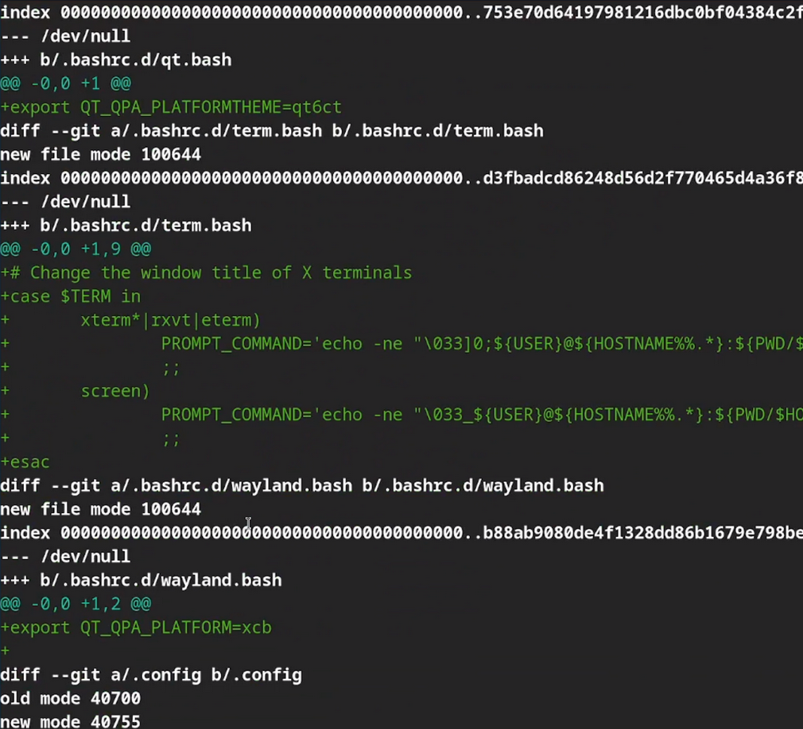
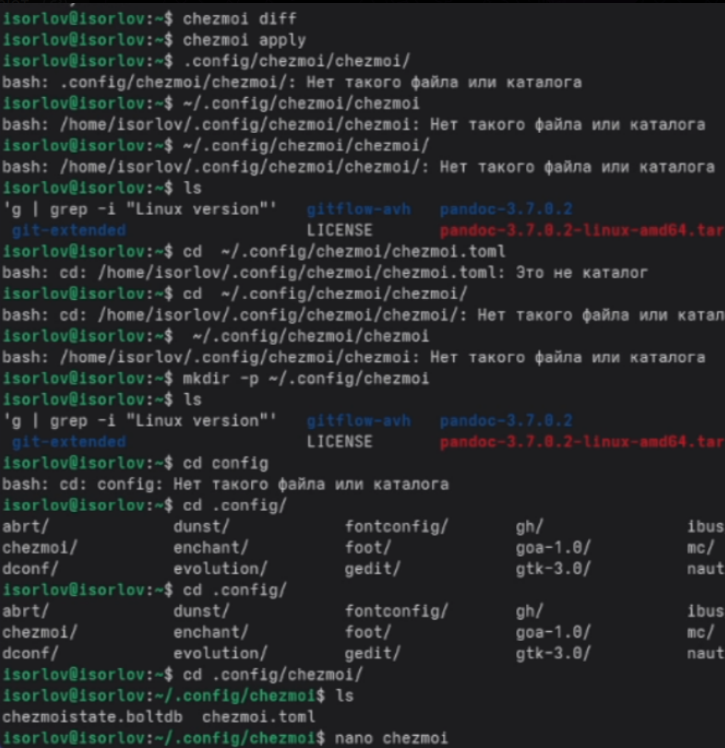
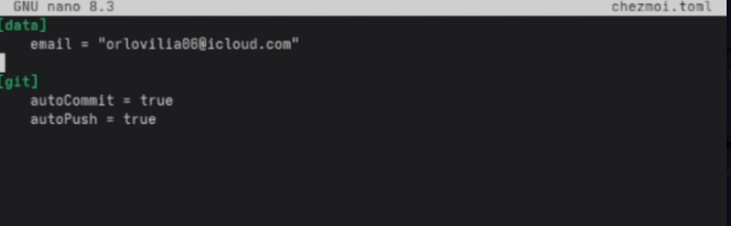

---
## Front matter
lang: ru-RU
title: Лабораторная работа №5
subtitle: Операционные системы
author:
  - Орлов И.С
institute:
  - Российский университет дружбы народов, Москва, Россия
date: 20 августа 2025

## i18n babel
babel-lang: russian
babel-otherlangs: english

## Formatting pdf
toc: false
toc-title: Содержание
slide_level: 2
aspectratio: 169
section-titles: true
theme: metropolis
header-includes:
 - \metroset{progressbar=frametitle,sectionpage=progressbar,numbering=fraction}
---

# Информация

## Докладчик

:::::::::::::: {.columns align=center}
::: {.column width="70%"}

  * Орлов Илья Сергеевич
  * Студент НКАбд-03-24
  * Российский университет дружбы народов
  * [1132241586@pfur.ru](1132241586@pfur.ru)

:::
::: {.column width="30%"}

:::
::::::::::::::

## Цель работы

Познакомиться с pass, gopass, native messaging, chezmoi. Научиться пользоваться этими утилитами, синхронизировать их с гит.

## Задание

1.Установить дополнительное ПО
2.Установить и настроить pass
3.Настроить интерфейс с браузером
4.Сохранить пароль
5.Установить и настроить chezmoi
6.Настроить chezmoi на новой машине
7.Выполнить ежедневные операции с chezmoi

## Теоретическое введение

Менеджер паролей pass — программа, сделанная в рамках идеологии Unix. Также носит название стандартного менеджера паролей для Unix (The standard Unix password manager).
1.1 Основные свойства
    Данные хранятся в файловой системе в виде каталогов и файлов.
    Файлы шифруются с помощью GPG-ключа.
1.2 Структура базы паролей
    Структура базы может быть произвольной, если Вы собираетесь использовать её напрямую, без промежуточного программного обеспечения. Тогда семантику структуры базы данных Вы держите в своей голове.
    Если же необходимо использовать дополнительное программное обеспечение, необходимо семантику заложить в структуру базы паролей.
chezmoi используется для управления файлами конфигурации домашнего каталога пользователя. 
Конфигурация chezmoi
    2.2.1 Рабочие файлы
    Состояние файлов конфигурации сохраняется в каталоге ~/.local/share/chezmoi. Он является клоном вашего репозитория dotfiles.
    Файл конфигурации ~/.config/chezmoi/chezmoi.toml (можно использовать также JSON или YAML) специфичен для локальной машины.
    Файлы, содержимое которых одинаково на всех ваших машинах, дословно копируются из исходного каталога.
    Файлы, которые варьируются от машины к машине, выполняются как шаблоны, обычно с использованием данных из файла конфигурации локальной машины для настройки конечного содержимого, специфичного для локальной машины.

## Выполнение лабораторной работы

Устанавливаю pass

{#fig:001 width=70%}

##

Инициаилизрую pass на машине и делаю первый пароль.

{#fig:002 width=70%}

##

Устанавливаю дополнительное ПО и шрифты.

{#fig:003 width=70%}

##

Инициализирую chezmoi с указанием на указанный в лабораторной работы репозиторий.

{#fig:004 width=70%}

##

Применяю конфиг.

{#fig:005 width=70%}

##

Проверяю изменения в удаленном репозитории.

{#fig:006 width=70%}

##

Отключаю автоматические сохранение изменений.

{#fig:007 width=70%}

## Выводы

Мы познакомились с pass, gopass, native messaging, chezmoi. Научились пользоваться этими утилитами, синхронизировали их с гит.
