---
## Front matter
title: "Лабораторная работа №6"
subtitle: "Дисциплина: Архитектура компьютера"
author: "Орлов Илья Сергеевич"

## Generic otions
lang: ru-RU
toc-title: "Содержание"

## Bibliography
bibliography: bib/cite.bib
csl: pandoc/csl/gost-r-7-0-5-2008-numeric.csl

## Pdf output format
toc: true # Table of contents
toc-depth: 2
lof: true # List of figures
lot: true # List of tables
fontsize: 12pt
linestretch: 1.5
papersize: a4
documentclass: scrreprt
## I18n polyglossia
polyglossia-lang:
  name: russian
  options:
	- spelling=modern
	- babelshorthands=true
polyglossia-otherlangs:
  name: english
## I18n babel
babel-lang: russian
babel-otherlangs: english
## Fonts
mainfont: IBM Plex Serif
romanfont: IBM Plex Serif
sansfont: IBM Plex Sans
monofont: IBM Plex Mono
mathfont: STIX Two Math
mainfontoptions: Ligatures=Common,Ligatures=TeX,Scale=0.94
romanfontoptions: Ligatures=Common,Ligatures=TeX,Scale=0.94
sansfontoptions: Ligatures=Common,Ligatures=TeX,Scale=MatchLowercase,Scale=0.94
monofontoptions: Scale=MatchLowercase,Scale=0.94,FakeStretch=0.9
mathfontoptions:
## Biblatex
biblatex: true
biblio-style: "gost-numeric"
biblatexoptions:
  - parentracker=true
  - backend=biber
  - hyperref=auto
  - language=auto
  - autolang=other*
  - citestyle=gost-numeric
## Pandoc-crossref LaTeX customization
figureTitle: "Рис."
tableTitle: "Таблица"
listingTitle: "Листинг"
lofTitle: "Список иллюстраций"
lotTitle: "Список таблиц"
lolTitle: "Листинги"
## Misc options
indent: true
header-includes:
  - \usepackage{indentfirst}
  - \usepackage{float} # keep figures where there are in the text
  - \floatplacement{figure}{H} # keep figures where there are in the text
---

# Цель работы

Приобретение практических навыков взаимодействия пользователя с системой посредством командной строки.

# Задание

1. Определите полное имя вашего домашнего каталога. Далее относительно этого ката-
лога будут выполняться последующие упражнения.
2. Выполните следующие действия:
2.1. Перейдите в каталог /tmp.
2.2. Выведите на экран содержимое каталога /tmp. Для этого используйте команду ls
с различными опциями. Поясните разницу в выводимой на экран информации.
2.3. Определите, есть ли в каталоге /var/spool подкаталог с именем cron?
2.4. Перейдите в Ваш домашний каталог и выведите на экран его содержимое. Опре-
делите, кто является владельцем файлов и подкаталогов?
3. Выполните следующие действия:
3.1. В домашнем каталоге создайте новый каталог с именем newdir.
3.2. В каталоге ~/newdir создайте новый каталог с именем morefun.
3.3. В домашнем каталоге создайте одной командой три новых каталога с именами
letters, memos, misk. Затем удалите эти каталоги одной командой.
3.4. Попробуйте удалить ранее созданный каталог ~/newdir командой rm. Проверьте,
был ли каталог удалён.
3.5. Удалите каталог ~/newdir/morefun из домашнего каталога. Проверьте, был ли
каталог удалён.
4. С помощью команды man определите, какую опцию команды ls нужно использо-
вать для просмотра содержимое не только указанного каталога, но и подкаталогов,
входящих в него.
5. С помощью команды man определите набор опций команды ls, позволяющий отсорти-
ровать по времени последнего изменения выводимый список содержимого каталога
с развёрнутым описанием файлов.
6. Используйте команду man для просмотра описания следующих команд: cd, pwd, mkdir,
rmdir, rm. Поясните основные опции этих команд.
7. Используя информацию, полученную при помощи команды history, выполните мо-
дификацию и исполнение нескольких команд из буфера команд.

# Теоретическое введение

В операционной системе типа Linux взаимодействие пользователя с системой обычно осуществляется с помощью командной строки посредством построчного ввода команд. При этом обычно используется командные интерпретаторы языка shell: /bin/sh; /bin/csh; /bin/ksh. Формат команды. Командой в операционной системе называется записанный по специальным правилам текст (возможно с аргументами), представляющий собой указание на выполнение какой-либо функций (или действий) в операционной системе.Обычно первым словом идёт имя команды, остальной текст — аргументы или опции, конкретизирующие действие. Общий формат команд можно представить следующим образом: <имя_команды><разделитель><аргументы>

# Выполнение лабораторной работы

Вывожу путь к домашнему каталогу, смотрю содержимое каталога tmp. (рис. -@fig:001)

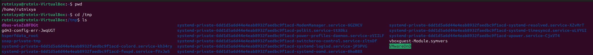{#fig:001 width=70%}

С разными флагами использую команду ls. (рис. -@fig:002)

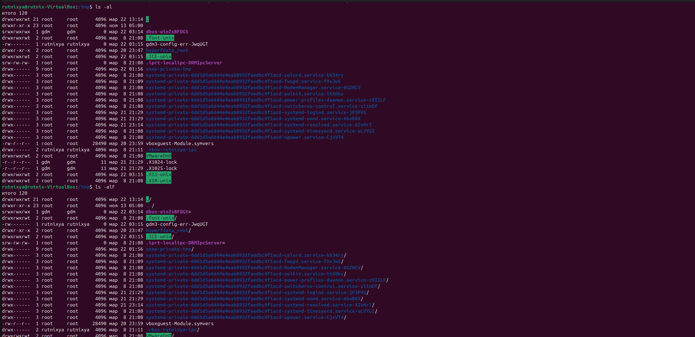{#fig:002 width=70%}

Проверяю, есть ли подкаталог cron в /var/spool. (рис. -@fig:003)

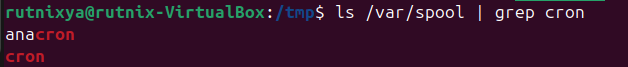{#fig:003 width=70%}

Возвращаюсь в домашний каталог, для этого достаточно ввести команду cd. Затем проверяю содержимое каталога с помощью утилиты ls, опция -l позволяет определить владельцев файлов, опция -a показывает все содержимое каталога, -F поможет определить что из содержимого каталога файл, а что каталог (рис. @fig:004).

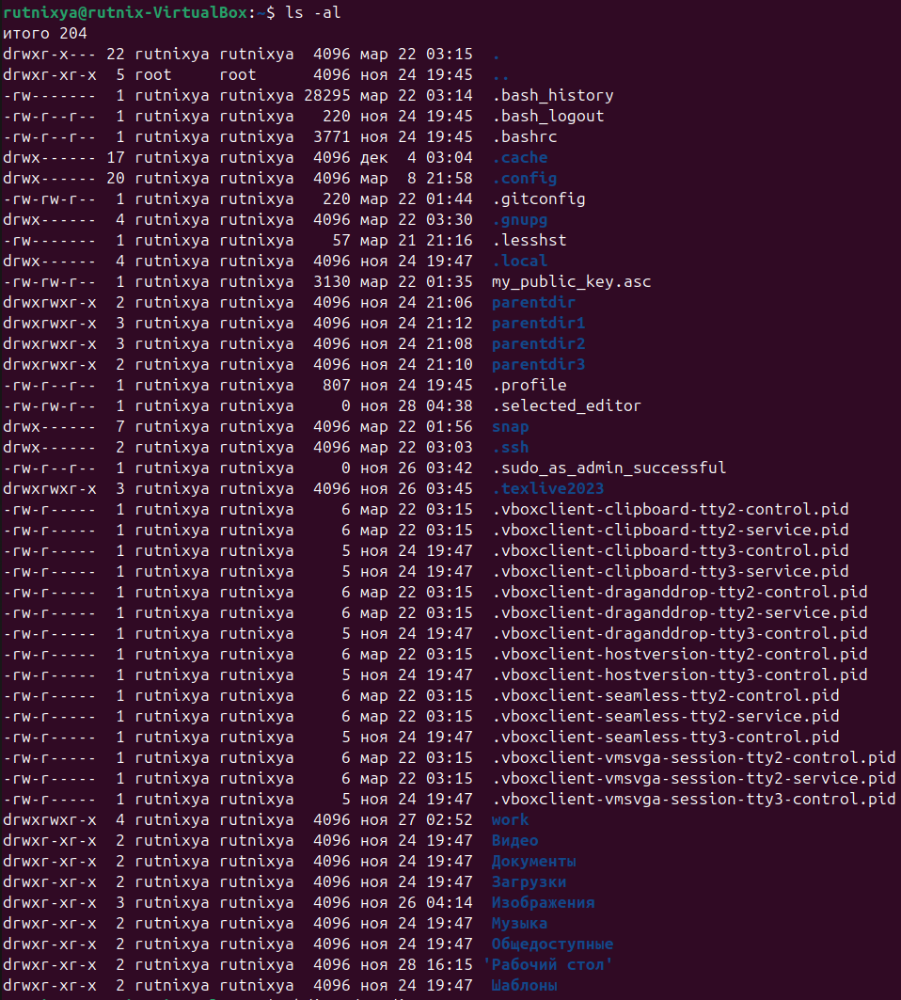{#fig:004 width=70%}

Создаю директорию newdir с помощью утилиты mkdir, затем проверяю, что директория создалась с помощью ls (рис. @fig:005).

{#fig:005 width=70%}

Создаю для каталога newdir подкаталог morefun, проверяю, что каталог собран (рис. @fig:006).

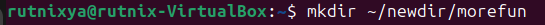{#fig:006 width=70%}

Чтобы создать несколько директорий одной строчкой нужно перечислить назваания директорий через пробел после утилиты mkdir (рис. @fig:007). Проверяю, что все файлы созданы.

{#fig:007 width=70%}

Чтобы удалить несколько **пустых** директорий одной строчкой нужно перечислить назваания директорий через пробел после утилиты rmdir (рис. @fig:008). Проверяю, что все файлы удалены.

{#fig:008 width=70%}

Пытаюсь удалить newdir с помощью rm. Утилита rm по умолчанию удаляет файлы, чтобы она удалила пустую директорию нужно добавить опцию -d, но newdir не пустая дериктория, поэтому нужно добавить опцию для рекурсивного удаления -r. Использовалась утилиты без опций, поэтому каталог не был удален (рис. @fig:009).

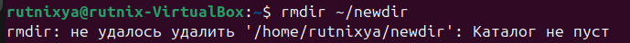{#fig:009 width=70%}

Удаляю директорию newdir с помощью утилиты rmdir, т.к директория не пустая, постепенно удаляю все подкаталоги (рис. @fig:009).

10.png{#fig:010 width=70%}

С помощью команды man ls я могу прочесть документацию к команде ls, опция, которая позолить выводить все подкаталоги каталогов предоставлена на скриншоте, это -R (рис. @fig:011).

{#fig:011 width=70%}

Так как мне нужно найти опцию утилиты ls для сортировки, то логично сузить поиск до резуьтатов с таким же вопросом. Выяснил, что для сортировки и выводда информации нужна комбинация опций -lt.

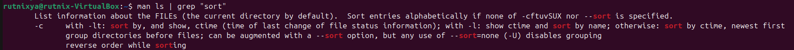{#fig:012 width=70%}

С помощью man cd узнаю описание команды cd и ее опции. Основных опций немного (рис. @fig:013).
1. -P - позволяет следовать по символическим ссылкам перед тем, как обработаны все переходы '..'
3. -L - переходит по символическим ссылкам только после того, как обработаны все переходы ".."
4. -e - позволяет выйти с ошибкой, если диреткория, в которую нужно перейти, не найдена.

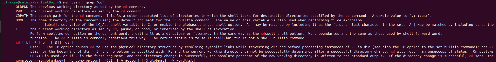{#fig:013 width=70%}

С помощью man pwd узнаю описание команды pwd и ее опции (рис. @fig:014).
1. -L - брать директорию из переменной окружения, даже если она содержит символические ссылки.
2. -P - отбрасывать все символические ссылки.

{#fig:014 width=70%}

С помощью man mkdir узнаю описание команды mkdir и ее опции (рис. @fig:015).
1. -m - устанавливает права доступа создаваемой директории как chmod, синтаксис тоже как у chmod.
2. -p - позволяет рекурсивно создавать директории и их подкаталоги
3. -v - выводи сообщение о созданных директориях
4. -z - установить контекст SELinux для создаваемой директории по умолчанию
5. -context - установить контекст SELinux для создаваемой директории в значении CTX

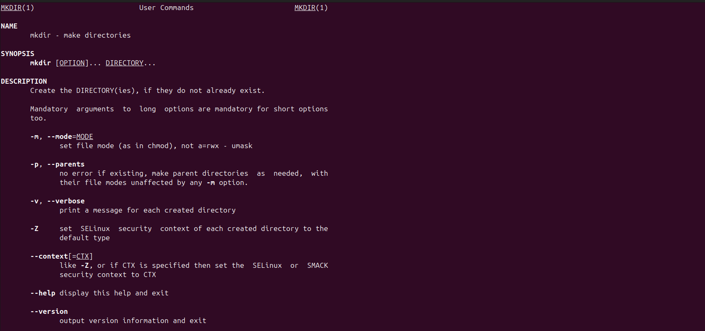{#fig:015 width=70%}

С помощью man rmdir узнаю описание команды rmdir и ее опции (рис. @fig:016).
1. --ignore-fail-on-non-empty - отменяет вывод ошибки, если каталог не пустой, просто его игнорирует
2. -p - удаляет рекурсивно каталоги, если они все содержат в себе только удаляемый каталог
3. -v - выводит сообщение о каждом удалении  директории.

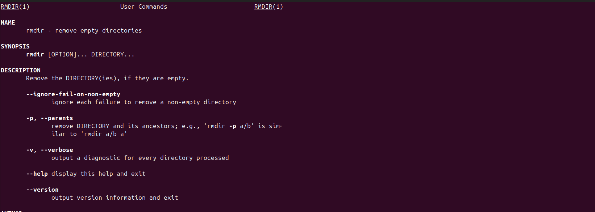{#fig:016 width=70%}

С помощью man rm узнаю описание команды rm и ее опции (рис. @fig:017).
1. -f - игнорировать несуществующие файлы или аргументы, никогда не выводить запрос на подтверждение удаления
2. -i - выводить запрос на подтверждение удаления каждого файла
3. -I - вывести запрос на подтверждение удаления один раз, для всех файлов, если удаляется больше 3-х файлов или идет рекурсивное удаление
4. --interactive - заменяет предыдущие три опции, можно выбрать одну из них.
5. --one-file-system - во время рекурсивного удаления пропускать директории из других файловых систем
6. --no-preserve-root если в качестве директории задана корневая, то считать что это обычная директория и начать удаление.
7. -r, -R - удаляет директории их содержимое рекурсивно
8. -d, --dir - удаляет пустые директории
9. -v - прописывает все действия команды

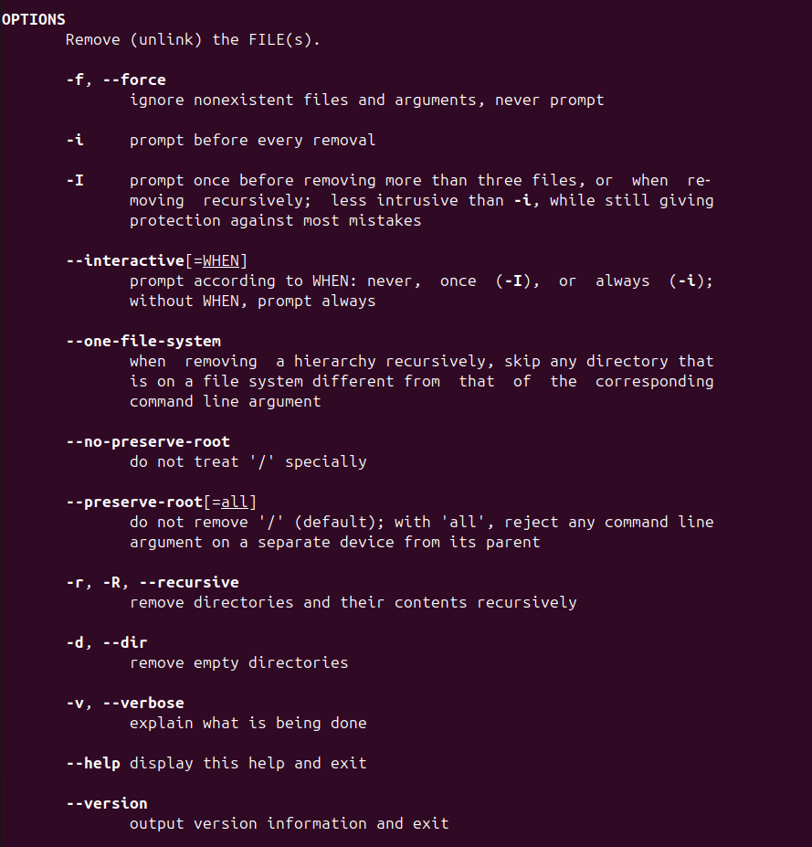{#fig:017 width=70%}

Опции --help --version применимы почти ко всем утилитам, они показывают справку по команде и ее версию соответственно.

Вывел историю команд с помощью утилиты history рис.  (рис. @fig:018).

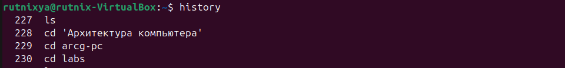{#fig:018 width=70%}

Смотрю историю команд и изменяю некоторые. (рис. -@fig:019)

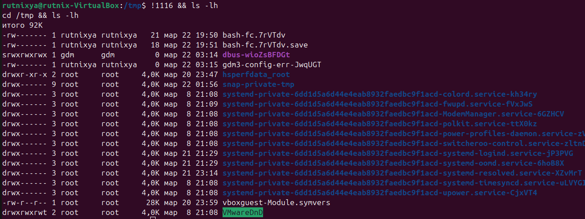{#fig:019 width=70%}

# Контрольные вопросы

1. Что такое командная строка? Командная строка (или «консоль») – это текстовый интерфейс между человеком и компьютером, в котором инструкции компьютеру даются путём ввода с клавиатуры текстовых строк (команд). Интерфейс командной строки противопоставляется управлению программами на основе меню, а также различным реализациям графического интерфейса. Команды, введённые пользователем, интерпретируются и выполняются специальной программой — командной оболочкой (или «shell» по-английски).
2. При помощи какой команды можно определить абсолютный путь текущего каталога? Приведите пример. Для определения абсолютного пути к текущему каталогу используется команда pwd (print working directory). Пример (абсолютное имя текущего каталога пользователя dharma): (pwd результат: /afs/dk.sci.pfu.edu.ru/home/d/h/dharma)
3. При помощи какой команды и каких опций можно определить только тип файлов и их имена в текущем каталоге? Приведите примеры. При помощи команды ls -F. (ls -F install-tl-unx/ newdir/ work/ Видео/ Документы/ Загрузки/ Изображения/ Музыка/ Общедоступные/ 'Рабочий стол'/ Шаблоны/)
4. Каким образом отобразить информацию о скрытых файлах? Приведите примеры. С помощью команды ls -a. (ls -a . .bash_logout .cache .gnupg .local .pki .var .vboxclient-draganddrop.pid .wget-hsts Документы Музыка Шаблоны .. .bash_profile .config install-tl-unx .mozilla .ssh .vboxclient-clipboard.pid .vboxclient-seamless.pid work Загрузки Общедоступные .bash_history .bashrc .gitconfig .lesshst newdir .texlive2022 .vboxclient-display-svga-x11.pid .vscode Видео Изображения 'Рабочий стол')
5. При помощи каких команд можно удалить файл и каталог? Можно ли это сделать одной и той же командой? Приведите примеры. Команда rm используется для удаления файлов и/или каталогов. Чтобы удалить каталог, содержащий файлы, нужно использовать опцию r. Без указания этой опции команда не будет выполняться (rm -r abc). Если каталог пуст, то можно воспользоваться командой rmdir. Если удаляемый каталог содержит файлы, то команда не будет выполнена — нужно использовать rm - r имя_каталога.
6. Каким образом можно вывести информацию о последних выполненных пользователем командах? работы? С помощью команды history.
7. Как воспользоваться историей команд для их модифицированного выполнения? Приведите примеры. Можно модифицировать команду из выведенного на экран списка при помощи следующей конструкции: !<номер_команды>:s/<что_меняем>/<на_что_меняем> (!3:s/a/F ls -F)
8. Приведите примеры запуска нескольких команд в одной строке. Если требуется выполнить последовательно несколько команд, записанный в одной строке, то для этого используется символ точка с запятой. (cd; ls)
9. Дайте определение и приведите примера символов экранирования. Если в заданном контексте встречаются специальные символы (типа «.», «/», «*» и т.д.), надо перед ними поставить символ экранирования \ (обратный слэш).
10. Охарактеризуйте вывод информации на экран после выполнения команды ls с опцией l. Чтобы вывести на экран подробную информацию о файлах и каталогах, необходимо использовать опцию l. При этом о каждом файле и каталоге будет выведена следующая информация: – тип файла, – право доступа, – число ссылок, – владелец, – размер, – дата последней ревизии, – имя файла или каталога.
11. Что такое относительный путь к файлу? Приведите примеры использования относительного и абсолютного пути при выполнении какой-либо команды. Относительный путь — это ссылка, указывающая на другие страницы вашего сайта относительно веб-страницы, на которой эта ссылка уже находится. Пример относительно пути: ./docs/files/file.txt Пример абсолютного пути: cd /home/dmbelicheva/work/study
12. Как получить информацию об интересующей вас команде? С помощью команды hepl.
13. Какая клавиша или комбинация клавиш служит для автоматического дополнения вводимых команд? Клавиша Tab.

# Выводы

Мы приобрели практические навыки взаимодействия пользователя с системой посредством командной строки.
