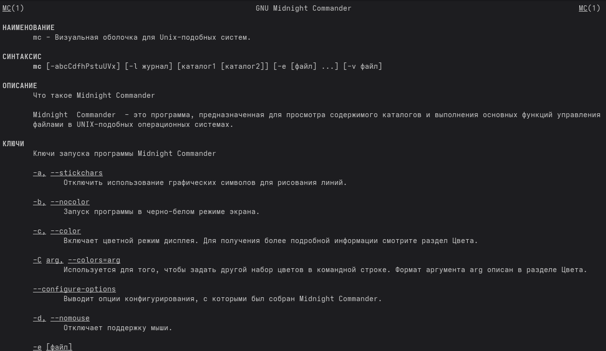
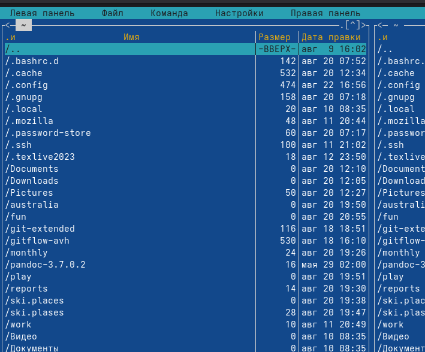
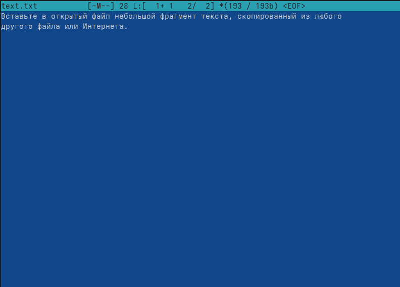

---
## Front matter
lang: ru-RU
title: Лабораторная работа №9
subtitle: Операционные системы
author:
  - Орлов И. С.
institute:
  - Российский университет дружбы народов, Москва, Россия
date: 23 августа 2025

## i18n babel
babel-lang: russian
babel-otherlangs: english

## Formatting pdf
toc: false
toc-title: Содержание
slide_level: 2
aspectratio: 169
section-titles: true
theme: metropolis
header-includes:
 - \metroset{progressbar=frametitle,sectionpage=progressbar,numbering=fraction}
---

# Информация

## Докладчик

:::::::::::::: {.columns align=center}
::: {.column width="70%"}

  * Орлов Илья Сергеевич
  * Студент НКАбд-03-24
  * Российский университет дружбы народов
  * [1132241586@pfur.ru](1132241586@pfur.ru)

:::
::: {.column width="30%"}

:::
::::::::::::::

## Цель 

Освоение основных возможностей командной оболочки Midnight Commander. Приоб-
ретение навыков практической работы по просмотру каталогов и файлов; манипуляций
с ними.

## Задание

1. Изучите информацию о mc, вызвав в командной строке man mc.
2. Запустите из командной строки mc, изучите его структуру и меню.
3. Выполните несколько операций в mc, используя управляющие клавиши (операции
с панелями; выделение/отмена выделения файлов, копирование/перемещение фай-
лов, получение информации о размере и правах доступа на файлы и/или каталоги
и т.п.)
4. Выполните основные команды меню левой (или правой) панели. Оцените степень
подробности вывода информации о файлах.

##

5. Используя возможности подменю Файл , выполните:
– просмотр содержимого текстового файла;
– редактирование содержимого текстового файла (без сохранения результатов
редактирования);
– создание каталога;
– копирование в файлов в созданный каталог.
6. С помощью соответствующих средств подменю Команда осуществите:
– поиск в файловой системе файла с заданными условиями (например, файла
с расширением .c или .cpp, содержащего строку main);
– выбор и повторение одной из предыдущих команд;
– переход в домашний каталог;
– анализ файла меню и файла расширений.

##

7. Вызовите подменю Настройки . Освойте операции, определяющие структуру экрана mc
(Full screen, Double Width, Show Hidden Files и т.д.)
1. Создайте текстовой файл text.txt.
2. Откройте этот файл с помощью встроенного в mc редактора.
3. Вставьте в открытый файл небольшой фрагмент текста, скопированный из любого
другого файла или Интернета.
4. Проделайте с текстом следующие манипуляции, используя горячие клавиши:
4.1. Удалите строку текста.

##

4.2. Выделите фрагмент текста и скопируйте его на новую строку.
4.3. Выделите фрагмент текста и перенесите его на новую строку.
4.4. Сохраните файл.
4.5. Отмените последнее действие.
4.6. Перейдите в конец файла (нажав комбинацию клавиш) и напишите некоторый
текст.
4.7. Перейдите в начало файла (нажав комбинацию клавиш) и напишите некоторый
текст.
4.8. Сохраните и закройте файл.
5. Откройте файл с исходным текстом на некотором языке программирования (напри-
мер C или Java)
6. Используя меню редактора, включите подсветку синтаксиса, если она не включена,
или выключите, если она включена.

## Теоретическое введение

Командная оболочка — интерфейс взаимодействия пользователя с операционной систе-
мой и программным обеспечением посредством команд.
Midnight Commander (или mc) — псевдографическая командная оболочка для UNIX/Linux
систем. Для запуска mc необходимо в командной строке набрать mc и нажать Enter .
Рабочее пространство mc имеет две панели, отображающие по умолчанию списки
файлов двух каталогов 

## Выполнение лабораторной работы

Читаю справку.

{#fig:001 width=70%}

##

Ознакамливаюсь с интерфейсом mc.

{#fig:002 width=70%}

##

Изучаю встроенный редактор mc.

{#fig:003 width=70%}

##

Изучаю особенности редактирования кода, подсвечивание синтаксиса.

{#fig:004 width=70%}

## Контрольные вопросы

1. Какие режимы работы есть в mc. Охарактеризуйте их.

Панели могут дополнительно быть переведены в один из двух режимов: Информация или Дерево. В режиме Информация на панель выводятся сведения о файле и текущей файловой системе, расположенных на активной панели. В режиме Дерево на одной из панелей выводится структура дерева каталогов.

##

2. Какие операции с файлами можно выполнить как с помощью команд shell, так и с помощью меню (комбинаций клавиш) mc? Приведите несколько примеров.

В разделе Командная строка оболочки (Shell) перечисляются команды и комбинации клавиш, которые используются для ввода и редактирования команд в командной строке оболочки. Большая часть этих команд служит для переноса имен файлов и/или имен каталогов в командную строку (чтобы уменьшить трудоемкость ввода) или для доступа к истории команд. Клавиши редактирования строк ввода используются как при редактировании командной строки, так и других строк ввода, появляющихся в различных запросах программы.
 Как с помощью меню так и с помощью команд shell можно переносить, копировать и получать информацию о файоах и каталогах.

##

3. Опишите структура меню левой (или правой) панели mc, дайте характеристику командам.

В меню каждой (левой или правой) панели можно выбрать Формат списка :

    стандартный — выводит список файлов и каталогов с указанием размера и времени правки;
    ускоренный — позволяет задать число столбцов, на которые разбивается панель при выводе списка имён файлов или каталогов без дополнительной информации;
    расширенный — помимо названия файла или каталога выводит сведения о правах доступа, владельце, группе, размере, времени правки;
    определённый пользователем — позволяет вывести те сведения о файле или каталоге, которые задаст сам пользователь.

##

4. Опишите структура меню Файл mc, дайте характеристику командам.

В меню Файл содержит перечень команд, которые могут быть применены к одному или нескольким файлам или каталогам.

##

Команды меню Файл :

    Просмотр ( F3 ) — позволяет посмотреть содержимое текущего (или выделенного) файла без возможности редактирования.
    Просмотр вывода команды ( М + ! ) — функция запроса команды с параметрами (аргумент к текущему выбранному файлу).
    Правка ( F4 ) — открывает текущий (или выделенный) файл для его редактирования.
    Копирование ( F5 ) — осуществляет копирование одного или нескольких файлов или каталогов в указанное пользователем во всплывающем окне место.
    Права доступа ( Ctrl-x c ) — позволяет указать (изменить) права доступа к одному или нескольким файлам или каталогам .
    Жёсткая ссылка ( Ctrl-x l ) — позволяет создать жёсткую ссылку к текущему (или выделенному) файлу.
  
##  
    Символическая ссылка ( Ctrl-x s ) — позволяет создать символическую ссылку к текущему (или выделенному) файлу.
    Владелец/группа ( Ctrl-x o ) — позволяет задать (изменить) владельца и имя группы для одного или нескольких файлов или каталогов.
    Права (расширенные) — позволяет изменить права доступа и владения для одного или нескольких файлов или каталогов.
    Переименование ( F6 ) — позволяет переименовать (или переместить) один или несколько файлов или каталогов.
    Создание каталога ( F7 ) — позволяет создать каталог.
    Удалить ( F8 ) — позволяет удалить один или несколько файлов или каталогов.
    Выход ( F10 ) — завершает работу mc.
    
##

5. Опишите структура меню Команда mc, дайте характеристику командам.

В меню Команда содержатся более общие команды для работы с mc. Команды меню Команда :

    Дерево каталогов — отображает структуру каталогов системы.
    Поиск файла — выполняет поиск файлов по заданным параметрам.
    Переставить панели — меняет местами левую и правую панели.
    Сравнить каталоги ( Ctrl-x d ) — сравнивает содержимое двух каталогов.
  
##
  
    Размеры каталогов — отображает размер и время изменения каталога (по умолчанию в mc размер каталога корректно не отображается).
    История командной строки — выводит на экран список ранее выполненных в оболочке команд.
    Каталоги быстрого доступа ( Ctrl-\ ) — пр вызове выполняется быстрая смена текущего каталога на один из заданного списка.
    Восстановление файлов — позволяет восстановить файлы на файловых системах ext2 и ext3.
    Редактировать файл расширений — позволяет задать с помощью определённого синтаксиса действия при запуске файлов с определённым расширением (например, какое программного обеспечение запускать для открытия или редактирования файлов с расширением doc или docx).
    Редактировать файл меню — позволяет отредактировать контекстное меню пользователя, вызываемое по клавише F2 .
    Редактировать файл расцветки имён — позволяет подобрать оптимальную для пользователя расцветку имён файлов в зависимости от их типа.
    
##

6. Опишите структура меню Настройки mc, дайте характеристику командам.

Меню Настройки содержит ряд дополнительных опций по внешнему виду и функциональности mc. Меню Настройки содержит: – Конфигурация — позволяет скорректировать настройки работы с панелями. – Внешний вид и Настройки панелей — определяет элементы (строка меню, командная строка, подсказки и прочее), отображаемые при вызове mc, а также геометрию расположения панелей и цветовыделение. – Биты символов — задаёт формат обработки информации локальным терминалом. – Подтверждение — позволяет установить или убрать вывод окна с запросом подтверждения действий при операциях удаления и перезаписи файлов, а также при выходе из программы. – Распознание клавиш — диалоговое окно используется для тестирования функциональных клавиш, клавиш управления курсором и прочее. – Виртуальные ФС –– настройки виртуальной файловой системы: тайм-аут, пароль и прочее.

##

7. Назовите и дайте характеристику встроенным командам mc.

F1 Вызов контекстно-зависимой подсказки; F2 Вызов пользовательского меню с возможностью создания и/или дополнения дополнительных функций; F3 Просмотр содержимого файла, на который указывает подсветка в активной панели (без возможности редактирования); F4 Вызов встроенного в mc редактора для изменения содержания файла, на который указывает подсветка в активной панели; F5 Копирование одного или нескольких файлов, отмеченных в первой (активной) панели, в каталог, отображаемый на второй панели; F6 Перенос одного или нескольких файлов, отмеченных в первой (активной) панели, в каталог, отображаемый на второй панели; F7 Создание подкаталога в каталоге, отображаемом в активной панели; F8 Удаление одного или нескольких файлов (каталогов), отмеченных в первой (активной) панели файлов; F9 Вызов меню mc; F10 Выход из mc;

##

8. Назовите и дайте характеристику командам встроенного редактора mc.

Ctrl-y удалить строку; Ctrl-u отмена последней операции; Ins вставка/замена; F7 поиск (можно использовать регулярные выражения); -F7 повтор последней операции поиска; F4 замена; F3 первое нажатие — начало выделения, второе — окончание выделения; F5 копировать выделенный фрагмент; F6 переместить выделенный фрагмент; F8 удалить выделенный фрагмент; F2 записать изменения в файл; F10 выйти из редактора. 9. Дайте характеристику средствам mc, которые позволяют создавать меню, определяемые пользователем.

##

Можете сохранить часто используемые команды панелизации под отдельными информативными именами, чтобы иметь возможность их быстро вызвать по этим именам. Для этого нужно набрать команду в строке ввода (строка "Команда") и нажать кнопку Добавить. После этого потребуется ввести имя, по которому мы будем вызывать команду. В следующий раз вам достаточно будет выбрать нужное имя из списка, а не вводить всю команду заново.

##

9. Файл ~/.mc/menu: Основа конфигурации: Главный файл, определяющий структуру и содержание пользовательских меню. Именно здесь вы прописываете пункты меню, их описания и команды, которые будут выполняться. Текстовый формат: Файл представляет собой простой текстовый файл, что делает его легко редактируемым в любом текстовом редакторе. Структура: Файл состоит из секций, каждая из которых определяет отдельное меню. Каждая секция начинается с заголовка, заключенного в квадратные скобки (например, [global] или [extension.txt]). Внутри секции определяются пункты меню.

##

 Синтаксис пунктов меню: Описание: Каждая строка, начинающаяся не с пробела и не с квадратной скобки, считается описанием пункта меню. Отображается в меню. Используйте | для разделения описания на несколько строк, которые будут показаны вместе. Команда: Следующая строка, начинающаяся с пробела (или табуляции), считается командой, которая будет выполнена при выборе этого пункта меню.
 Переменные окружения и подстановки: Поддерживаются различные переменные окружения (например, $PWD - текущий каталог, $SELECTED - выбранные файлы) и подстановки, позволяющие динамически формировать команды. Встроенные функции mc: Доступны встроенные функции mc, которые могут выполнять различные действия, такие как запуск редактора, просмотр файла и т.д. Пример: edit %f откроет выбранный файл в редакторе.
 
##
 
 Контекстная чувствительность меню: Секции меню для разных типов файлов: Можно создавать секции меню, специфичные для определённых расширений файлов (например, [extension.sh] для shell-скриптов). В этих секциях определяются действия, которые будут доступны только при выборе файлов с указанным расширением. Секция [global]: Определяет пункты меню, доступные всегда, независимо от выбранного файла. Совместное использование: Если выбрано несколько файлов, меню, специфичные для каждого из них, объединяются. Если есть конфликты (одинаковое описание), пункт меню будет выполнен для первого подходящего типа файла.

##

Гибкость и настраиваемость: Запуск внешних программ: Можно запускать любые внешние программы и скрипты из меню. Параметры для команд: Можно передавать параметры в запускаемые команды, используя переменные и подстановки.   Создание подменю: Хотя в самом файле .mc/menu нет явной структуры для подменю, можно эмулировать их, запуская скрипты, которые отображают диалоговые окна выбора или модифицируют ~/.mc/menu на лету. Разделение конфигураций: Можно использовать несколько файлов меню (например, ~/.mc/menu.personal), а затем подключать их из основного файла.

##

10. Дайте характеристику средствам mc, которые позволяют выполнять действия, определяемые пользователем, над текущим файлом.

Панель в mc отображает список файлов текущего каталога. Абсолютный путь к этому каталогу отображается в заголовке панели. У активной панели заголовок и одна из её строк подсвечиваются. Управление панелями осуществляется с помощью определённых комбинаций клавиш или пунктов меню mc.

## Выводы

Мы освоили основные возможности командной оболочки Midnight Commander. Приоб-
рели навыки практической работы по просмотру каталогов и файлов; манипуляций
с ними.
