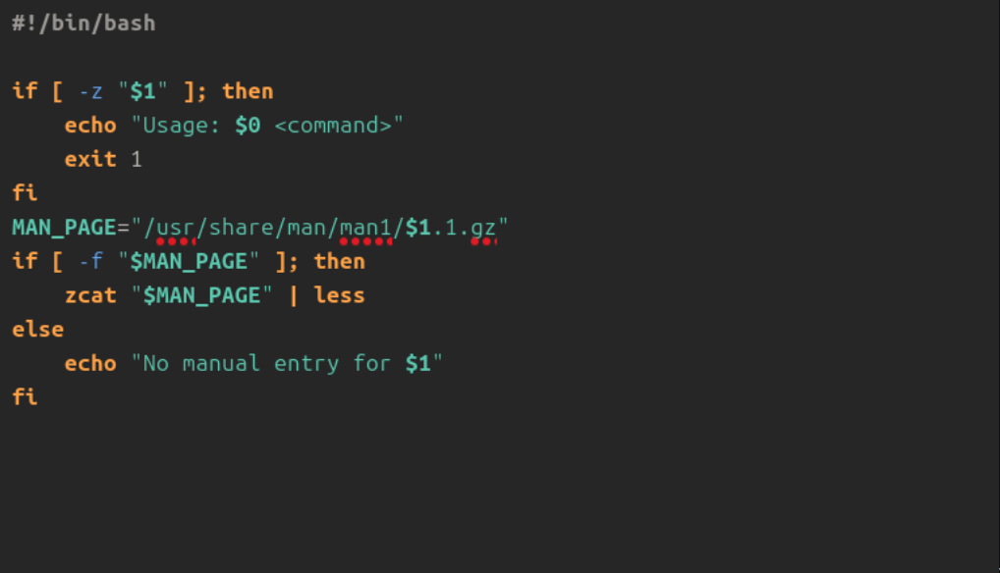
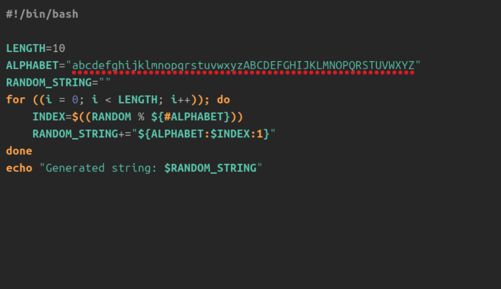

---
## Front matter
lang: ru-RU
title: Лабораторная работа №14
subtitle: Операционные системы
author:
  - Орлов Илья Сергеевич
institute:
  - Российский университет дружбы народов, Москва, Россия
date: 26 августа 2025

## i18n babel
babel-lang: russian
babel-otherlangs: english

## Formatting pdf
toc: false
toc-title: Содержание
slide_level: 2
aspectratio: 169
section-titles: true
theme: metropolis
header-includes:
 - \metroset{progressbar=frametitle,sectionpage=progressbar,numbering=fraction}
---

# Информация

## Докладчик

:::::::::::::: {.columns align=center}
::: {.column width="70%"}

  * Орлов Илья Сергеевич
  * Студент НКАбд-03-24
  * Российский университет дружбы народов
  * [1132241586@pfur.ru](1132241586@pfur.ru)

:::
::: {.column width="30%"}

:::
::::::::::::::

## Цель 

Изучить основы программирования в оболочке ОС UNIX. Научиться писать более
сложные командные файлы с использованием логических управляющих конструкций
и циклов.

## Задание

1. Написать командный файл, реализующий упрощённый механизм семафоров. Ко-
мандный файл должен в течение некоторого времени t1 дожидаться освобождения
ресурса, выдавая об этом сообщение, а дождавшись его освобождения, использовать
его в течение некоторого времени t2<>t1, также выдавая информацию о том, что
ресурс используется соответствующим командным файлом (процессом). Запустить
командный файл в одном виртуальном терминале в фоновом режиме, перенаправив
его вывод в другой (> /dev/tty#, где # — номер терминала куда перенаправляется
вывод), в котором также запущен этот файл, но не фоновом, а в привилегированном
режиме. Доработать программу так, чтобы имелась возможность взаимодействия трёх
и более процессов.

##

2. Реализовать команду man с помощью командного файла. Изучите содержимое ката-
лога /usr/share/man/man1. В нем находятся архивы текстовых файлов, содержащих
справку по большинству установленных в системе программ и команд. Каждый архив
можно открыть командой less сразу же просмотрев содержимое справки. Командный
файл должен получать в виде аргумента командной строки название команды и в виде
результата выдавать справку об этой команде или сообщение об отсутствии справки,
если соответствующего файла нет в каталоге man1.
3. Используя встроенную переменную $RANDOM, напишите командный файл, генерирую-
щий случайную последовательность букв латинского алфавита. Учтите, что $RANDOM
выдаёт псевдослучайные числа в диапазоне от 0 до 32767.

## Теоретическое введение

Командный процессор (командная оболочка, интерпретатор команд shell) — это про-
грамма, позволяющая пользователю взаимодействовать с операционной системой
компьютера. В операционных системах типа UNIX/Linux наиболее часто используются
следующие реализации командных оболочек:
– оболочка Борна (Bourne shell или sh) — стандартная командная оболочка UNIX/Linux,
содержащая базовый, но при этом полный набор функций;
– С-оболочка (или csh) — надстройка на оболочкой Борна, использующая С-подобный
синтаксис команд с возможностью сохранения истории выполнения команд;
– оболочка Корна (или ksh) — напоминает оболочку С, но операторы управления програм-
мой совместимы с операторами оболочки Борна;

##

– BASH — сокращение от Bourne Again Shell (опять оболочка Борна), в основе своей сов-
мещает свойства оболочек С и Корна (разработка компании Free Software Foundation).
POSIX (Portable Operating System Interface for Computer Environments) — набор стандартов
описания интерфейсов взаимодействия операционной системы и прикладных программ.
Стандарты POSIX разработаны комитетом IEEE (Institute of Electrical and Electronics
Engineers) для обеспечения совместимости различных UNIX/Linux-подобных опера-
ционных систем и переносимости прикладных программ на уровне исходного кода.
POSIX-совместимые оболочки разработаны на базе оболочки Корна.

## Выполнение лабораторной работы

1. Написать командный файл, реализующий упрощённый механизм семафоров. Ко-
мандный файл должен в течение некоторого времени t1 дожидаться освобождения
ресурса, выдавая об этом сообщение, а дождавшись его освобождения, использовать
его в течение некоторого времени t2<>t1, также выдавая информацию о том, что
ресурс используется соответствующим командным файлом (процессом). Запустить
командный файл в одном виртуальном терминале в фоновом режиме, перенаправив
его вывод в другой (> /dev/tty#, где # — номер терминала куда перенаправляется
вывод), в котором также запущен этот файл, но не фоновом, а в привилегированном
режиме. Доработать программу так, чтобы имелась возможность взаимодействия трёх
и более процессов.

{#fig:001 width=70%}

##

2. Реализовать команду man с помощью командного файла. Изучите содержимое ката-
лога /usr/share/man/man1. В нем находятся архивы текстовых файлов, содержащих
справку по большинству установленных в системе программ и команд. Каждый архив
можно открыть командой less сразу же просмотрев содержимое справки. Командный
файл должен получать в виде аргумента командной строки название команды и в виде
результата выдавать справку об этой команде или сообщение об отсутствии справки,
если соответствующего файла нет в каталоге man1.

{#fig:002 width=70%} 

##

3.  Используя встроенную переменную $RANDOM, напишите командный файл, генерирую-
щий случайную последовательность букв латинского алфавита. Учтите, что $RANDOM
выдаёт псевдослучайные числа в диапазоне от 0 до 32767.

{#fig:003 width=70%} 

## Контрольные вопросы

1. Найдите синтаксическую ошибку в следующей строке: 1 while [$1 != "exit"]
В данной строчке допущены следующие ошибки: не хватает пробелов после первой скобки [ и перед второй скобкой ] выражение $1 необходимо взять в “”, потому что эта переменная может содержать пробелы Таким образом, правильный вариант должен выглядеть так: while [ “$1” != "exit" ]

##

2. Как объединить (конкатенация) несколько строк в одну?
Чтобы объединить несколько строк в одну, можно воспользоваться несколькими способами: Первый: VAR1="Hello," VAR2=" World" VAR3="$VAR1$VAR2" echo "$VAR3" Результат: Hello, World Второй: VAR1="Hello, " VAR1+=" World" echo "$VAR1" Результат: Hello, World

##

3. Найдите информацию об утилите seq. Какими иными способами можно реализовать её функционал при программировании на bash?
Команда seq в Linux используется для генерации чисел от ПЕРВОГО до ПОСЛЕДНЕГО шага INCREMENT. Параметры: seq LAST: если задан только один аргумент, он создает числа от 1 до LAST с шагом шага, равным 1. Если LAST меньше 1, значение 
is не выдает. seq FIRST LAST: когда заданы два аргумента, он генерирует числа от FIRST до LAST с шагом 1, равным 1. Если LAST меньше FIRST, он не выдает никаких выходных данных. seq FIRST INCREMENT LAST: когда заданы три аргумента, 
он генерирует числа от FIRST до LAST на шаге INCREMENT. Если LAST меньше, чем FIRST, он не производит вывод. seq -f «FORMAT» FIRST INCREMENT LAST: эта команда используется для генерации последовательности в форматированном виде. 
FIRST и INCREMENT являются необязательными. seq -s «STRING» ПЕРВЫЙ ВКЛЮЧЕНО: Эта команда используется для STRING для разделения чисел. По умолчанию это значение равно /n. FIRST и INCREMENT являются необязательными. seq -w FIRST 
INCREMENT LAST: эта команда используется для выравнивания ширины путем заполнения начальными нулями. FIRST и INCREMENT являются необязательными.

##

4. Какой результат даст вычисление выражения $((10/3))?
Результатом данного выражения $((10/3)) будет 3, потому что это целочисленное деление без остатка.

##

5. Укажите кратко основные отличия командной оболочки zsh от bash.
Отличия командной оболочки zsh от bash: В zsh более быстрое автодополнение для cd с помощью Тab В zsh существует калькулятор zcalc, способный выполнять вычисления внутри терминала В zsh поддерживаются числа с плавающей запятой В zsh поддерживаются структуры данных «хэш» В zsh поддерживается раскрытие полного пути на основенеполных данных В zsh поддерживается замена части пути В zsh есть возможность отображать разделенный экран, такой же как разделенный экран vim

##

6. Проверьте, верен ли синтаксис данной конструкции 1 for ((a=1; a <= LIMIT; a++))
for ((a=1; a <= LIMIT; a++)) синтаксис данной конструкции верен, потому что, используя двойные круглые скобки, можно не писать $ перед переменными ().

##

7. Сравните язык bash с какими-либо языками программирования. Какие преимущества у bash по сравнению с ними? Какие недостатки?
Преимущества и недостатки скриптового языка bash:
Один из самых распространенных и ставится по умолчанию в большинстве дистрибутивах Linux, MacOS
Удобное перенаправление ввода/вывода
Большое количество команд для работы с файловыми системами Linux
Можно писать собственные скрипты, упрощающие работу в Linux Недостатки скриптового языка bash:
Дополнительные библиотеки других языков позволяют выполнить больше действий
Bash не является языков общего назначения
Утилиты, при выполнении скрипта, запускают свои процессы, которые, в свою очередь, отражаются на быстроте выполнения этого скрипта
Скрипты, написанные на bash, нельзя запустить на других операционных системах без дополнительных действий

## Выводы

Мы изучили основы программирования в оболочке ОС UNIX. Научились писать более
сложные командные файлы с использованием логических управляющих конструкций
и циклов.
