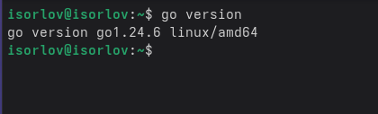
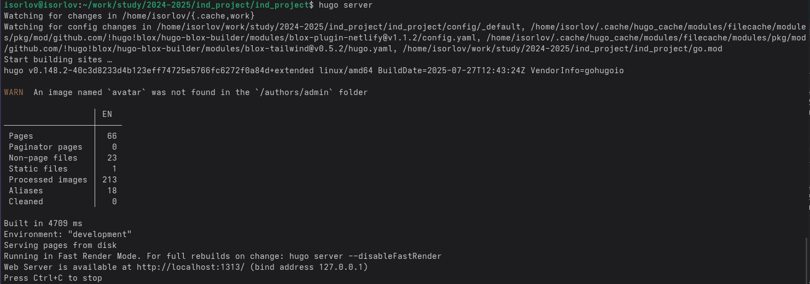
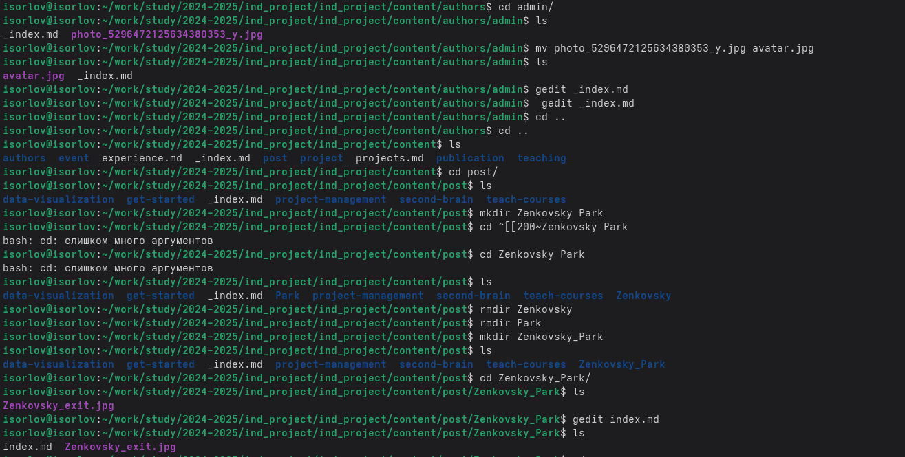
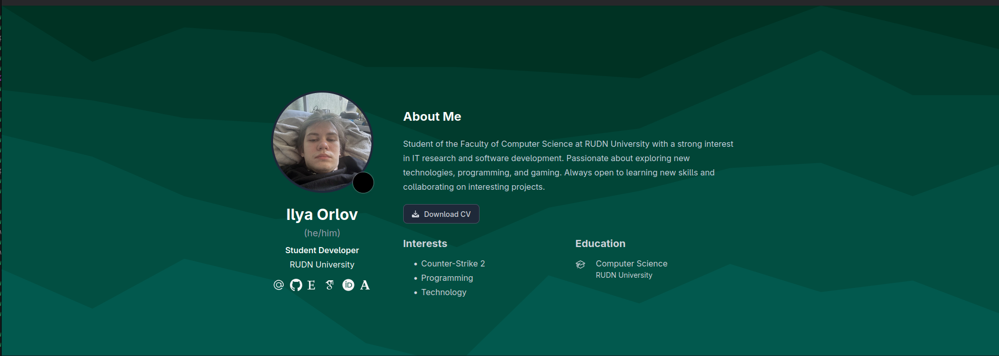

---
## Front matter
lang: ru-RU
title: Индивидуальный проект 2 этап
subtitle: Операционные системы
author:
  - Орлов И. С.
institute:
  - Российский университет дружбы народов, Москва, Россия
date: 28 августа 2025

## i18n babel
babel-lang: russian
babel-otherlangs: english

## Formatting pdf
toc: false
toc-title: Содержание
slide_level: 2
aspectratio: 169
section-titles: true
theme: metropolis
header-includes:
 - \metroset{progressbar=frametitle,sectionpage=progressbar,numbering=fraction}
---

# Информация

## Докладчик

:::::::::::::: {.columns align=center}
::: {.column width="70%"}

  * Орлов Илья Сергеевич
  * Студент НКАбд-03-24
  * Российский университет дружбы народов
  * [1132241586@pfur.ru](1132241586@pfur.ru)

:::
::: {.column width="30%"}

:::
::::::::::::::

## Цель работы

Продолжить работу с сайтом, редактировать его в соответствии с требованиями, добавить данные о себе на сайт.

## Задание

1. Разместить фотографию владельца сайта.
2. Разместить краткое описание владельца сайта (Biography).
3. Добавить информацию об интересах (Interests).
4. Добавить информацию от образовании (Education).
5. Сделать пост по прошедшей неделе.
6. Добавить пост на тему по выбору: Управление версиями. Git. Непрерывная интеграция и непрерывное развертывание (CI/CD).

## Выполнение индивидуального проекта

Скачию язык go для того чтобы изменения на сайте можно было тестировать локально. 

{#fig:001 width=70%}

##

Проверка запуска сайта на виртуальной машине. 

{#fig:002 width=70%}

##

Загружаю в директорию сайта измененый файл с биографией и два поста. 

{#fig:003 width=70%}

##

Проверка изменений на сайте. 

{#fig:004 width=70%}

## Выводы

Мы продолжили работу с сайтом, редактировали его в соответствии с требованиями, добавили данные о себе на сайт.
