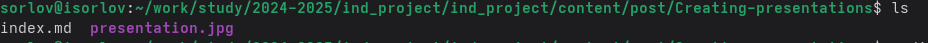
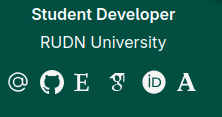

---
## Front matter
lang: ru-RU
title: Индивидуальный проект 4 этап
subtitle: Операционные системы
author:
  - Орлов И. С.
institute:
  - Российский университет дружбы народов, Москва, Россия
date: 28 авшуста 2025

## i18n babel
babel-lang: russian
babel-otherlangs: english

## Formatting pdf
toc: false
toc-title: Содержание
slide_level: 2
aspectratio: 169
section-titles: true
theme: metropolis
header-includes:
 - \metroset{progressbar=frametitle,sectionpage=progressbar,numbering=fraction}
---

# Информация

## Докладчик

:::::::::::::: {.columns align=center}
::: {.column width="70%"}

  * Орлов Илья Сергеевич
  * Студент НКАбд-03-24
  * Российский университет дружбы народов
  * [1132241586@pfur.ru](1132241586@pfur.ru)

:::
::: {.column width="30%"}

:::
::::::::::::::

## Цель работы

Продолжить работу с сайтом, добавить к сайту ссылки на научные и библиометрические ресурсы, сделать пост по выбору и по прошедшей неделе.

## Задание

1. Зарегистрироваться на соответствующих ресурсах и разместить на них ссылки на сайте: eLibrary : https://elibrary.ru/; Google Scholar : https://scholar.google.com/; ORCID : https://orcid.org/; Mendeley : https://www.mendeley.com/; ResearchGate : https://www.researchgate.net/; Academia.edu : https://www.academia.edu/; arXiv : https://arxiv.org/; github : https://github.com/.
2. Сделать пост по прошедшей неделе.
3. Добавить пост на тему по выбору: Оформление отчёта. Создание презентаций. Работа с библиографией.

## Выполнение индивидуального проекта

Переношу в директорию с сайтом измененный файл с биографией и два новых поста. (рис. -@fig:001)

{#fig:001 width=70%}

##

Проверяю изменение на сайте. (рис. -@fig:002)

{#fig:002 width=70%}

## Выводы

Мы продолжили работу с сайтом, добавили к сайту ссылки на научные и библиометрические ресурсы, сделали пост по выбору и по прошедшей неделе.
